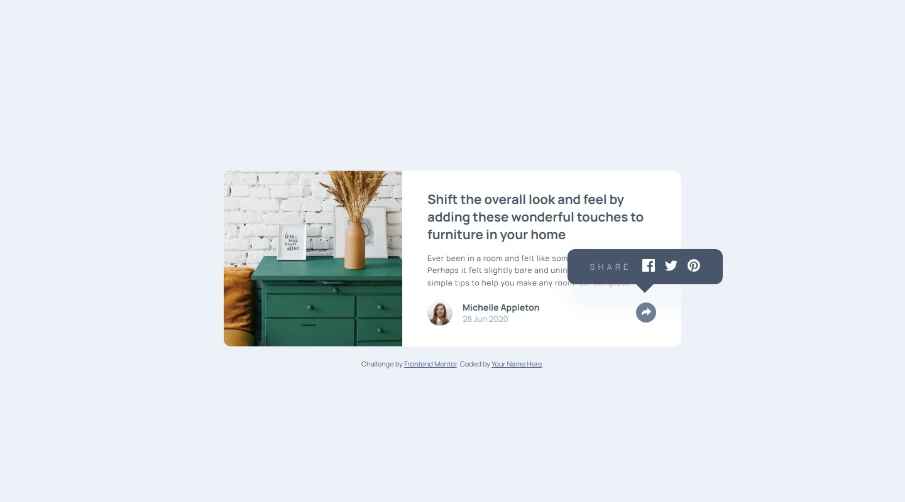

# Frontend Mentor - Article preview component solution

This is a solution to the [Article preview component challenge on Frontend Mentor](https://www.frontendmentor.io/challenges/article-preview-component-dYBN_pYFT). Frontend Mentor challenges help you improve your coding skills by building realistic projects.

## Table of contents

- [Overview](#overview)
  - [The challenge](#the-challenge)
  - [Screenshot](#screenshot)
  - [Links](#links)
- [My process](#my-process)
  - [Built with](#built-with)
  - [What I learned](#what-i-learned)
  - [Continued development](#continued-development)
  <!-- - [Useful resources](#useful-resources) -->
- [Author](#author)
<!-- - [Acknowledgments](#acknowledgments) -->

## Overview

### The challenge

Users should be able to:

- View the optimal layout for the component depending on their device's screen size
- See the social media share links when they click the share icon

### Screenshot

### Links

- Solution URL: https://github.com/isnandar1471/Frontend-Mentor-Solutions/tree/main/Article%20preview%20component
- Live Site URL: https://isnandar1471.github.io/Frontend-Mentor-Solutions/Article%20preview%20component/

## My process

### Built with

- Semantic HTML5 markup
- CSS custom properties
- Flexbox
- CSS Grid
- Mobile-first workflow
  <!-- - [React](https://reactjs.org/) - JS library -->
  <!-- - [Next.js](https://nextjs.org/) - React framework -->
  <!-- - [Styled Components](https://styled-components.com/) - For styles -->

### What I learned

- Absolute with `left: 0; right: 0;` and Fixed Width

  If an element is `absolute` with both `left: 0` and `right: 0` **and has a fixed width**,  
  the browser prioritizes **`left: 0`** and ignores **`right: 0`**.

  To make both work, the width must be `auto` (it will then stretch between left and right).

### Continued development

- I still don’t understand why using `.elementAbsolute { z-index: 1; }` with  
  `.elementAbsolute::after { z-index: 0; }` results in the pseudo-element staying **above** its parent, even though its z-index is lower.

<!-- ### Useful resources -->

<!-- - [Example resource 1](https://www.example.com) - This helped me for XYZ reason. I really liked this pattern and will use it going forward. -->
<!-- - [Example resource 2](https://www.example.com) - This is an amazing article which helped me finally understand XYZ. I'd recommend it to anyone still learning this concept. -->

## Author

- Website - [Isnandar Fajar Pangestu]()
- Frontend Mentor - [@isnandar1471](https://www.frontendmentor.io/profile/isnandar1471)
<!-- - Twitter - [@yourusername](https://www.twitter.com/yourusername) -->

<!-- ## Acknowledgments -->

<!-- This is where you can give a hat tip to anyone who helped you out on this project. Perhaps you worked in a team or got some inspiration from someone else's solution. This is the perfect place to give them some credit. -->
