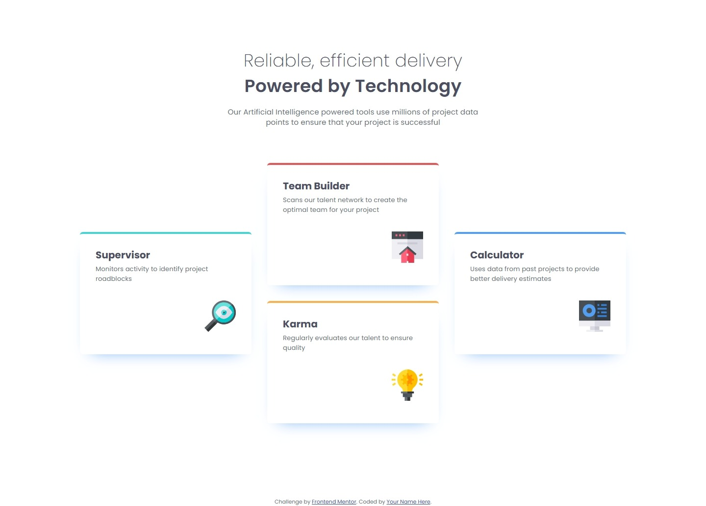

# Frontend Mentor - Four card feature section solution

This is a solution to the [Four card feature section challenge on Frontend Mentor](https://www.frontendmentor.io/challenges/four-card-feature-section-weK1eFYK). Frontend Mentor challenges help you improve your coding skills by building realistic projects. 

## Table of contents

- [Overview](#overview)
  - [The challenge](#the-challenge)
  - [Screenshot](#screenshot)
  - [Links](#links)
- [My process](#my-process)
  - [Built with](#built-with)
  <!-- - [What I learned](#what-i-learned) -->
  <!-- - [Continued development](#continued-development) -->
  <!-- - [Useful resources](#useful-resources) -->
- [Author](#author)
<!-- - [Acknowledgments](#acknowledgments) -->

## Overview

### The challenge

Users should be able to:

- View the optimal layout for the site depending on their device's screen size

### Screenshot



### Links

- Solution URL: https://github.com/isnandar1471/Frontend-Mentor-Solutions/tree/main/Four%20card%20feature%20section
- Live Site URL: https://frontend-mentor-solutions-four-card.vercel.app/

## My process

### Built with

- Semantic HTML5 markup
- CSS custom properties
- Flexbox
- CSS Grid
- Mobile-first workflow
<!-- - [React](https://reactjs.org/) - JS library -->
<!-- - [Next.js](https://nextjs.org/) - React framework -->
<!-- - [Styled Components](https://styled-components.com/) - For styles -->

### What I learned

- Variable cannot be used in media query. Only fixed value can be used in media query

❌ This will not work ❌

```css
@media (min-width: var(--layout-mobile)) {
  ...
}
```

<!-- ### Continued development

Use this section to outline areas that you want to continue focusing on in future projects. These could be concepts you're still not completely comfortable with or techniques you found useful that you want to refine and perfect. -->

<!-- ### Useful resources

- [Example resource 1](https://www.example.com) - This helped me for XYZ reason. I really liked this pattern and will use it going forward.
- [Example resource 2](https://www.example.com) - This is an amazing article which helped me finally understand XYZ. I'd recommend it to anyone still learning this concept. -->

## Author

<!-- - Website - [Add your name here](https://www.your-site.com) -->
- Frontend Mentor - [@isnandar1471](https://www.frontendmentor.io/profile/isnandar1471)
<!-- - Twitter - [@yourusername](https://www.twitter.com/yourusername) -->

<!-- ## Acknowledgments

This is where you can give a hat tip to anyone who helped you out on this project. Perhaps you worked in a team or got some inspiration from someone else's solution. This is the perfect place to give them some credit. -->
