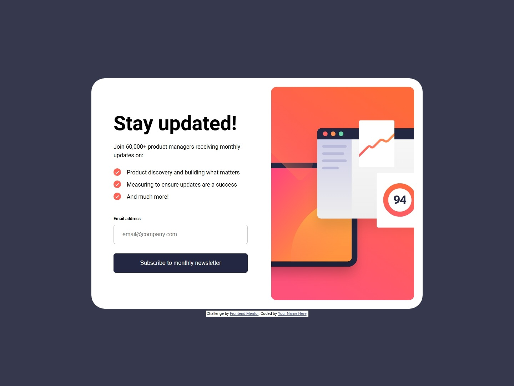

# Frontend Mentor - Newsletter sign-up form with success message solution

This is a solution to the [Newsletter sign-up form with success message challenge on Frontend Mentor](https://www.frontendmentor.io/challenges/newsletter-signup-form-with-success-message-3FC1AZbNrv). Frontend Mentor challenges help you improve your coding skills by building realistic projects.

## Table of contents

- [Overview](#overview)
  - [The challenge](#the-challenge)
  - [Screenshot](#screenshot)
  - [Links](#links)
- [My process](#my-process)
  - [Built with](#built-with)
  - [What I learned](#what-i-learned)
  - [Continued development](#continued-development)
  - [Useful resources](#useful-resources)
- [Author](#author)
- [Acknowledgments](#acknowledgments)

## Overview

### The challenge

Users should be able to:

- Add their email and submit the form
- See a success message with their email after successfully submitting the form
- See form validation messages if:
  - The field is left empty
  - The email address is not formatted correctly
- View the optimal layout for the interface depending on their device's screen size
- See hover and focus states for all interactive elements on the page

### Screenshot



Other screenshots in [solution](./solution/)

### Links

- Solution URL: https://github.com/isnandar1471/Frontend-Mentor-Solutions/tree/main/Newsletter%20sign-up%20form%20with%20success%20message
- Live Site URL: https://isnandar1471.github.io/Frontend-Mentor-Solutions/Newsletter%20sign-up%20form%20with%20success%20message/

## My process

### Built with

- Semantic HTML5 markup
- CSS custom properties
- Flexbox
- CSS Grid
- Mobile-first workflow
  <!-- - [React](https://reactjs.org/) - JS library -->
  <!-- - [Next.js](https://nextjs.org/) - React framework -->
  <!-- - [Styled Components](https://styled-components.com/) - For styles -->

### What I learned

- **`<picture>` element**

  - Sources must be listed from the **most specific** to the **most general**.
    ```html
    <picture>
      <source
        srcset="./assets/images/illustration-sign-up-desktop.svg"
        media="(min-width: 720px)"
      />
      <source
        srcset="./assets/images/illustration-sign-up-tablet.svg"
        media="(min-width: 376px)"
      />
      
    </picture>
    ```
  - Default `display` is **inline**.
    - Inline _non-replaced_ elements (e.g., `<span>`) cannot have their `width` and `height` set.
    - `<picture>` is also inline by default, so to control its size you usually change it to `display: block` or `inline-block`.

- **`` element**

  - Default `display` is **inline** (an inline replaced element).
  - As an inline element, `` aligns with the text baseline, which creates extra space at the bottom (descender space).

    - Solution: change to `display: block`, or adjust with `vertical-align: middle/top/bottom`.

- **Flex and Grid**

  - A child with `margin-...: auto` can absorb all remaining free space.

    - `flex-direction: column` → `margin-top: auto` pushes the element to the bottom by absorbing space above.
    - `flex-direction: row` → `margin-left: auto` pushes the element to the right by absorbing space on the left.

- **Normal layout (not flex/grid)**

  - `margin-inline: auto` works for horizontal centering (as long as the block element has a set width).
  - `margin-block: auto` does **not** work for vertical centering.

<!-- ### Continued development -->

<!-- Use this section to outline areas that you want to continue focusing on in future projects. These could be concepts you're still not completely comfortable with or techniques you found useful that you want to refine and perfect. -->

<!-- ### Useful resources -->

<!-- - [Example resource 1](https://www.example.com) - This helped me for XYZ reason. I really liked this pattern and will use it going forward. -->
<!-- - [Example resource 2](https://www.example.com) - This is an amazing article which helped me finally understand XYZ. I'd recommend it to anyone still learning this concept. -->

## Author

- Website - [Isnandar Fajar Pangestu](https://www.your-site.com)
- Frontend Mentor - [@isnandar1471](https://www.frontendmentor.io/profile/isnandar1471)
<!-- - Twitter - [@yourusername](https://www.twitter.com/yourusername) -->

<!-- ## Acknowledgments -->

<!-- This is where you can give a hat tip to anyone who helped you out on this project. Perhaps you worked in a team or got some inspiration from someone else's solution. This is the perfect place to give them some credit. -->
