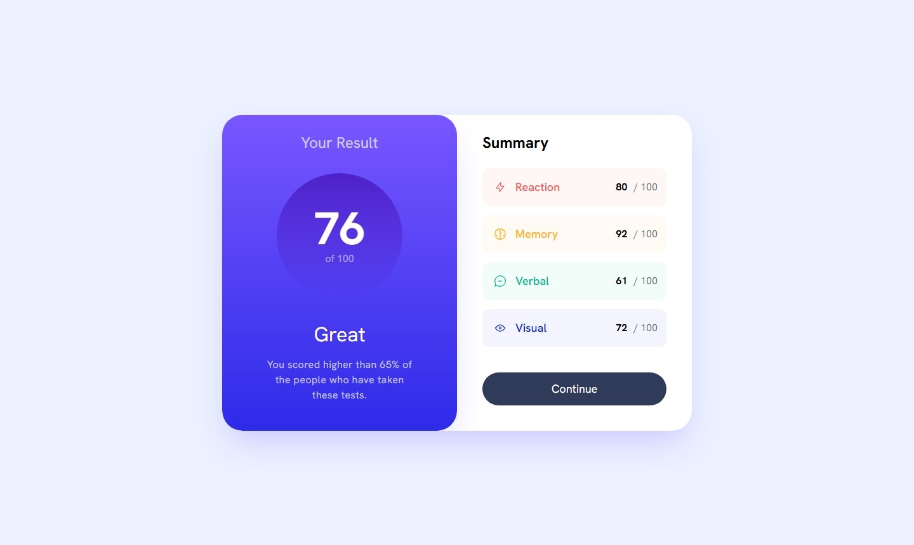

# Frontend Mentor - Results summary component solution

This is a solution to the [Results summary component challenge on Frontend Mentor](https://www.frontendmentor.io/challenges/results-summary-component-CE_K6s0maV). Frontend Mentor challenges help you improve your coding skills by building realistic projects. 

## Table of contents

- [Overview](#overview)
  - [The challenge](#the-challenge)
  - [Screenshot](#screenshot)
  - [Links](#links)
- [My process](#my-process)
  - [Built with](#built-with)
  - [What I learned](#what-i-learned)
  - [Continued development](#continued-development)
- [Author](#author)

## Overview

### The challenge

Users should be able to:

- View the optimal layout for the interface depending on their device's screen size
- See hover and focus states for all interactive elements on the page
- **Bonus**: Use the local JSON data to dynamically populate the content

### Screenshot

### Links

- Solution URL: https://github.com/isnandar1471/Frontend-Mentor-Solutions/tree/main/Results%20summary%20component
- Live Site URL: https://isnandar1471.github.io/Frontend-Mentor-Solutions/Results%20summary%20component/build

## My process

### Built with

- Semantic HTML5 markup
- CSS custom properties
- Flexbox
- Mobile-first workflow
- [React](https://reactjs.org/) - JS library

### What I learned

In this exercise, I learned to use ReactJS + TailwindCSS.
I learned to use useState and useEffect from ReactJS.

### Continued development

I will continue to train my knowledge related to ReactJS & TailwindCSS, so that my coding will be better than my current coding.

## Author

- Website - [sudutfajar.my.id](https://sudutfajar.my.id)
- Frontend Mentor - [@isnandar1471](https://www.frontendmentor.io/profile/isnandar1471)
