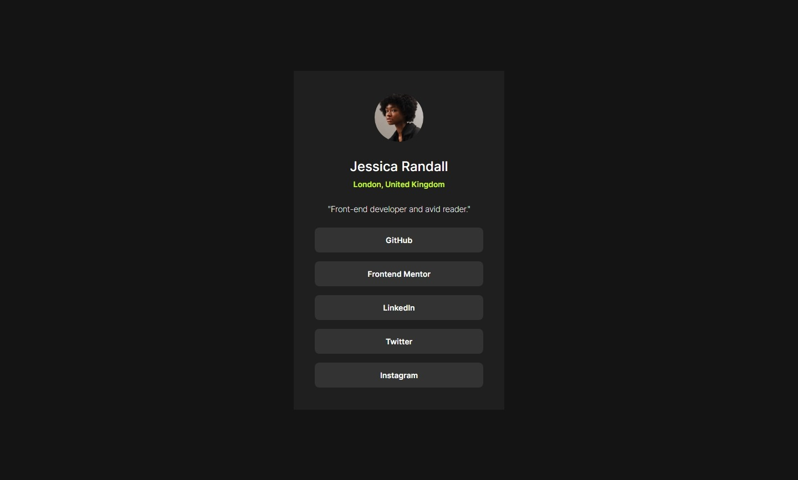

# Frontend Mentor - Social links profile solution

This is a solution to the [Social links profile challenge on Frontend Mentor](https://www.frontendmentor.io/challenges/social-links-profile-UG32l9m6dQ). Frontend Mentor challenges help you improve your coding skills by building realistic projects.

## Table of contents

- [Overview](#overview)
  - [The challenge](#the-challenge)
  - [Screenshot](#screenshot)
  - [Links](#links)
- [My process](#my-process)
  - [Built with](#built-with)
  <!-- - [What I learned](#what-i-learned)
  - [Continued development](#continued-development)
  - [Useful resources](#useful-resources) -->
- [Author](#author)
<!-- - [Acknowledgments](#acknowledgments) -->

## Overview

### The challenge

Users should be able to:

- See hover and focus states for all interactive elements on the page

### Screenshot



### Links

- Solution URL: https://github.com/isnandar1471/Frontend-Mentor-Solutions/tree/main/Social%20links%20profile
- Live Site URL: https://frontend-mentor-solutions-social-li.vercel.app/

## My process

### Built with

- Semantic HTML5 markup
- CSS custom properties
- Flexbox
- Mobile-first workflow

### What I learned

#### Alternative `margin-left` & `margin-right` only, or `margin-top` & `margin-bottom` only

```css
/* Instead */
.card {
  margin-left: auto;
  margin-right: auto;
}
/* Use */
.card {
  margin-inline: auto;
}
```

```css
/* Instead */
.card {
  margin-top: auto;
  margin-bottom: auto;
}
/* Use */
.card {
  margin-block: auto;
}
```

Note: margin-inline and margin-block are not shorthand for margin-left/right or margin-top/bottom. They're actually shorthand for margin-inline-start/end and margin-block-start/end.

These properties follow the text direction. If your text direction is the default (Left-to-Right), you can safely use them. Otherwise, consider if they're the right choice. 

<!--
### Continued development

Use this section to outline areas that you want to continue focusing on in future projects. These could be concepts you're still not completely comfortable with or techniques you found useful that you want to refine and perfect.

**Note: Delete this note and the content within this section and replace with your own plans for continued development.**

### Useful resources

- [Example resource 1](https://www.example.com) - This helped me for XYZ reason. I really liked this pattern and will use it going forward.
- [Example resource 2](https://www.example.com) - This is an amazing article which helped me finally understand XYZ. I'd recommend it to anyone still learning this concept.

**Note: Delete this note and replace the list above with resources that helped you during the challenge. These could come in handy for anyone viewing your solution or for yourself when you look back on this project in the future.** -->

## Author

- Website - [Isnandar Fajar Pangestu](https://sudutfajar.my.id)
- Frontend Mentor - [@isnandar1471](https://www.frontendmentor.io/profile/isnandar1471)
<!--

## Acknowledgments

This is where you can give a hat tip to anyone who helped you out on this project. Perhaps you worked in a team or got some inspiration from someone else's solution. This is the perfect place to give them some credit.

**Note: Delete this note and edit this section's content as necessary. If you completed this challenge by yourself, feel free to delete this section entirely.** -->
