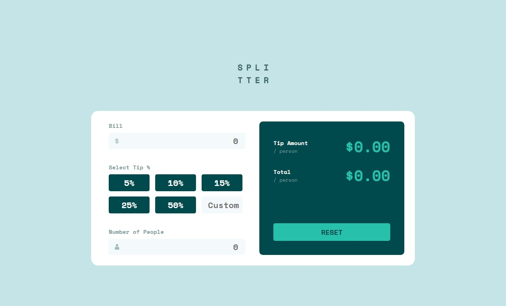

# Frontend Mentor - Tip calculator app solution

This is a solution to the [Tip calculator app challenge on Frontend Mentor](https://www.frontendmentor.io/challenges/tip-calculator-app-ugJNGbJUX). Frontend Mentor challenges help you improve your coding skills by building realistic projects.

## Table of contents

- [Overview](#overview)
  - [The challenge](#the-challenge)
  - [Screenshot](#screenshot)
  - [Links](#links)
- [My process](#my-process)
  - [Built with](#built-with)
  - [What I learned](#what-i-learned)
- [Author](#author)

## Overview

### The challenge

Users should be able to:

- View the optimal layout for the app depending on their device's screen size
- See hover states for all interactive elements on the page
- Calculate the correct tip and total cost of the bill per person

### Screenshot

### Links

- Solution URL: https://github.com/isnandar1471/Frontend-Mentor-Solutions/tree/main/Tip%20calculator%20app
- Live Site URL: https://isnandar1471.github.io/Frontend-Mentor-Solutions/Tip%20calculator%20app

## My process

### Built with

- Semantic HTML5 markup
- CSS custom properties
- Flexbox
- Mobile-first workflow

### What I learned

> If you feel tired, take a break. But immediately continue what you left unfinished.
> If it's really difficult, try starting over from the beginning. Maybe you're just thinking too much about things that aren't really important.

## Author

- Website - [sudutfajar.my.id](sudutfajar.my.id)
- Frontend Mentor - [@isnandar1471](https://www.frontendmentor.io/profile/isnandar1471)
